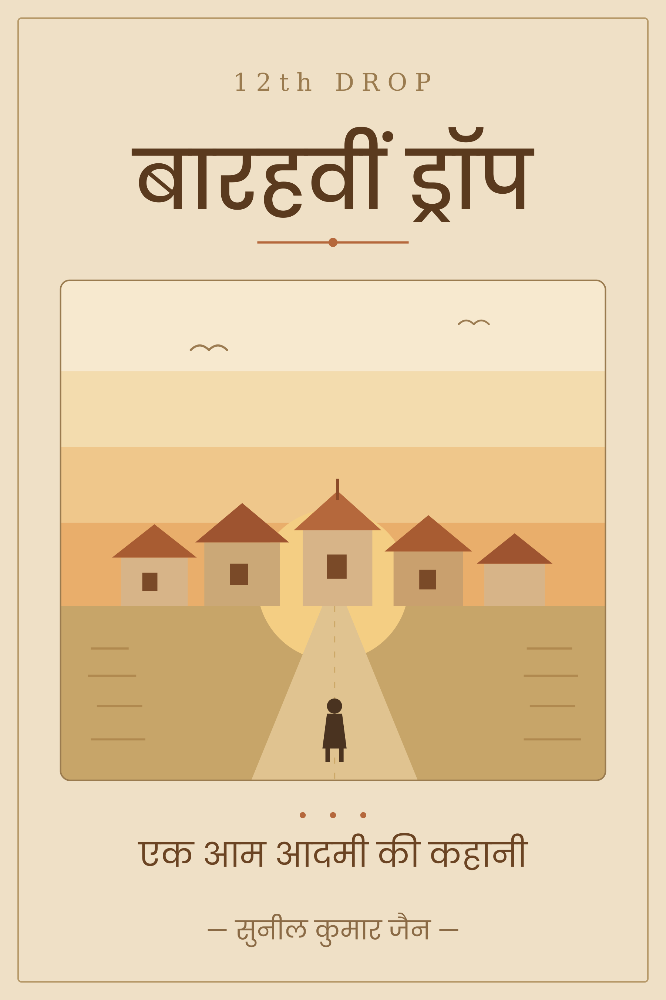
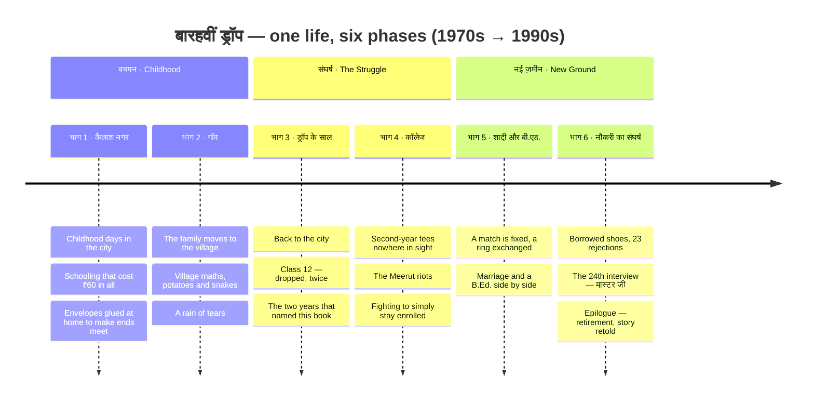

<h1>12th Drop · बारहवीं ड्रॉप</h1>
<h3>एक आम आदमी की कहानी · A Story of Every Common Man</h3>

by <b>Sunil Kumar Jain</b> &nbsp;·&nbsp; told by <b>Sachin &amp; Rahul Jain</b>

  
  &nbsp;
  

---

## यह किसी हीरो की कहानी नहीं है · Not a hero's story

> यह किसी हीरो की कहानी नहीं है।
> यह उस आम आदमी की कहानी है, जो हर घर में कहीं न कहीं रहता है।

Sunil Kumar Jain was a boy from an ordinary Indian family: poverty, an unfinished education, the taunts of society, and the weight of a household — he carried it all, and never gave up.

*12th Drop* is woven from real conversations between a father and his son. There is nothing manufactured in it, and it preaches no sermon — just life, as it truly is. From ₹60 schooling and two years lost after Class 12, through twenty-three failed job interviews, to becoming a teacher on the twenty-fourth.

Every incident in the book is true, lifted straight from life (only a few names are changed). It began as a small gift from the children to their father on his retirement — and became the story of millions of ordinary people.

| ₹60 | 2 | 23 | 36 |
|:---:|:---:|:---:|:---:|
| total schooling Classes 1–8 | years lost after Class 12 | interviews then the 24th | chapters 6 phases |

## The Journey · छह भाग में एक सफ़र

The story runs from the 1970s to the early 1990s — from a one-room childhood in Kailash Nagar to a teacher's chair, one phase at a time.

| # | भाग | Phase | Chapters | What happens |
|:-:|-----|-------|:--------:|--------------|
| 1 | कैलाश नगर — बचपन के दिन | Childhood in Kailash Nagar | 1–6 | A city childhood of scarcity: ₹60 covers all of school, the household runs on hand-glued envelopes. |
| 2 | गाँव | The Village | 7–11 | Years in the village — new maths, new hardships, and a rain of tears. |
| 3 | ड्रॉप के साल | The Drop Years | 12–17 | Return to the city and the fall at Class 12 — the two dropped years the book is named after. |
| 4 | कॉलेज | College | 18–22 | Unpaid fees, the Meerut riots, chemistry practicals — a degree earned against the odds. |
| 5 | शादी और बी.एड. | Marriage & B.Ed. | 23–27 | A house, a wedding ring, and a B.Ed. — building a life while still building himself. |
| 6 | नौकरी का संघर्ष | The Struggle for a Job | 28–36 | Twenty-three interviews end in "no". The twenty-fourth makes him **मास्टर जी** — the teacher. The epilogue: his retirement, where this book began. |

## Read it

- **Website** — [12thdrop.in](https://12thdrop.in) · read the opening pages in an interactive flip-book, in Hindi or English.
- **Kindle** — [amazon.in/dp/B0H7CKSGB2](https://www.amazon.in/dp/B0H7CKSGB2)
- **Contact** — [sachinjain024@gmail.com](mailto:sachinjain024@gmail.com)

---

Curious how this site works? The website is a single static HTML file with a page-flip reader — see [WEBSITE.md](WEBSITE.md) for how it's built and maintained.
