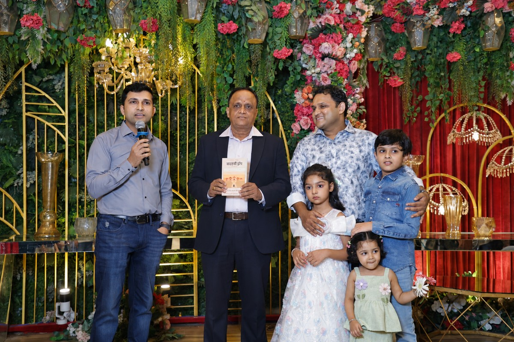

<h1>12th Drop · बारहवीं ड्रॉप</h1>
<h3>एक आम आदमी की कहानी · A Story of Every Common Man</h3>

by <b>Sachin &amp; Rahul Jain</b>

  
  &nbsp;
  

---

## यह किसी हीरो की कहानी नहीं है · Not a hero's story

> यह किसी हीरो की कहानी नहीं है।
> यह उस आम आदमी की कहानी है, जो हर घर में कहीं न कहीं रहता है।

Sunil Kumar Jain was a boy from an ordinary Indian family: poverty, an unfinished education, the taunts of society, and the weight of a household — he carried it all, and never gave up.

*12th Drop* is woven from real conversations between a father and his son. There is nothing manufactured in it, and it preaches no sermon — just life, as it truly is. From ₹60 schooling and two years lost after Class 12, through twenty-three failed job interviews, to becoming a teacher on the twenty-fourth.

Every incident in the book is true, lifted straight from life (only a few names are changed). It began as a small gift from the children to their father on his retirement — and became the story of millions of ordinary people.

## Motivation

Papa's Retirement Gift

As children we watched our father struggle, though he rarely let us see it. The school job, the weight of the household, and every need of ours, big or small — he carried it all quietly, without complaint.

Whatever we have become, the foundation is his labour.

As his retirement day drew near, we kept asking ourselves: what do you give a man who spent his whole life teaching other people's children? Then it came to us — what greater gift than his own story, bound as a book?

So we wrote down the stories we had heard from him across years of conversations. It was placed in his hands at his retirement function — our way of saying thank you.

— Sachin &amp; Rahul Jain —

## Read it

- **Website** — [12thdrop.in](https://12thdrop.in) · read the opening pages in an interactive flip-book, in Hindi or English.
- **Kindle** — [amazon.in/dp/B0H7CKSGB2](https://www.amazon.in/dp/B0H7CKSGB2)
- **Contact** — [sachinjain024@gmail.com](mailto:sachinjain024@gmail.com)

---

Curious how this site works? The website is a single static HTML file with a page-flip reader — see [WEBSITE.md](WEBSITE.md) for how it's built and maintained.
